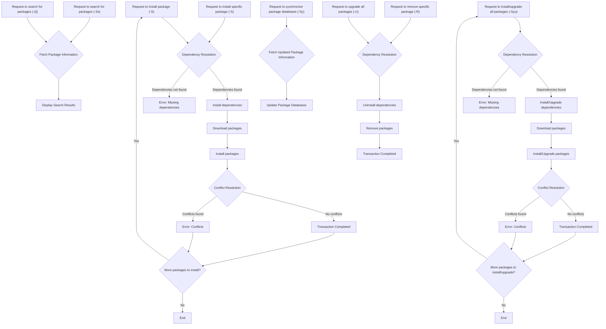

```mermaid
graph TD
;
    A["Request to install package (-S)"] --> B{Dependency Resolution};
    B -->|Dependencies found| C["Install dependencies"];
    B -->|Dependencies not found| D["Error: Missing dependencies"];
    C --> E["Download packages"];
    E --> F["Install packages"];
    F --> G{Conflict Resolution};
    G -->|No conflicts| H["Transaction Completed"];
    G -->|Conflicts found| I["Error: Conflicts"];
    H --> J{"More packages to install?"};
    I --> J;
    J -->|Yes| A;
    J -->|No| K["End"];
    L["Request to search for packages (-Ss)"] --> M{"Fetch Package Information"};
    M --> N["Display Search Results"];
    O["Request to synchronize package databases (-Sy)"] --> P{"Fetch Updated Package Information"};
    P --> Q["Update Package Databases"];
    R["Request to install/upgrade all packages (-Syu)"] --> S{Dependency Resolution};
    S -->|Dependencies found| T["Install/Upgrade dependencies"];
    S -->|Dependencies not found| U["Error: Missing dependencies"];
    T --> V["Download packages"];
    V --> W["Install/Upgrade packages"];
    W --> X{Conflict Resolution};
    X -->|No conflicts| Y["Transaction Completed"];
    X -->|Conflicts found| Z["Error: Conflicts"];
    Y --> AA{"More packages to install/upgrade?"};
    Z --> AA;
    AA -->|Yes| R;
    AA -->|No| AB["End"];
    A1["Request to install specific package (-S)"] --> B;
    B2["Request to remove specific package (-R)"] --> C2{Dependency Resolution};
    C2 --> D2["Uninstall dependencies"];
    D2 --> E2["Remove packages"];
    E2 --> F2["Transaction Completed"];
    G1["Request to search for packages (-Q)"] --> M;
    J1["Request to upgrade all packages (-U)"] --> C2;

```